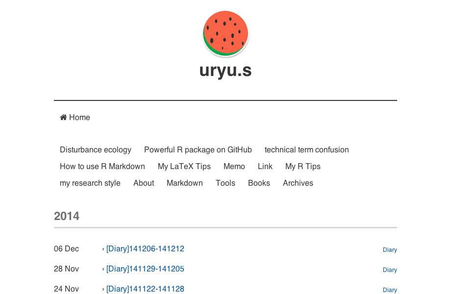
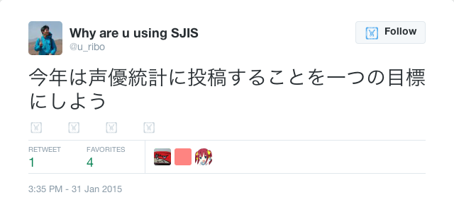

GitHubにて開発中 -> https://github.com/wch/webshot

ここで実行したバージョンは0.1。

------

# 環境設定

パッケージのインストールとともに、依存環境の[PhantomJS](http://phantomjs.org)をインストールする必要がある。こちらの

ref) [PhantomJS でログインが必要なページでも自由自在にスクレイピング - 凹みTips](http://tips.hecomi.com/entry/20121229/1356785834)


自分はHomebrewを使ってインストールした

```{bash}
brew update && brew install phantomjs
```

# 使い方

メインの関数は`webshot`関数。こちらの関数の引数にWebサイトのURLを渡すと、スクリーンショットを撮影する。標準では画像サイズは920 $\times$ 600となる。引数でファイル名や画像サイズ、画像の切り抜きなどを指定可能。

```{r demo.webshot, eval = FALSE}
library("webshot")
webshot("http://suryu.me", "mysite.png", cliprect = "viewport")
```



## webshot関数の引数

* url... スクリーンショットを撮影するwebサイトのURL
* file... ファイル名。拡張子`.png`をつける必要がある
* vwidth
* vheight
* cliprect
* selector... webサイトが指定しているCSSの一部を撮影する際のオプション
* delay... 撮影開始時間を秒単位で遅らせる

# Twitterつぶやきの魚拓

**20150203更新**

プレゼンテーションなどでTwitterのつぶやきを参照することがしばしばあるので、`webshot`パッケージを使って簡単に魚拓がとれるようにした。

```{r tweet_gyotaku, eval = FALSE}
webshot("https://twitter.com/u_ribo/status/561669079430201344", "test150201.png", 
        selector = ".expansion-container") # select CSS
```


